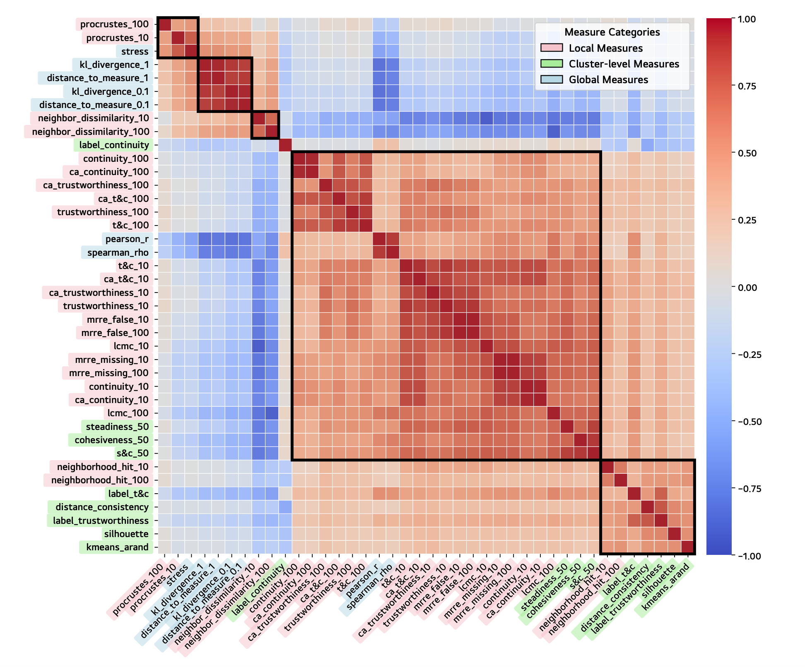

<link rel="stylesheet" href="assets/css/custom.css">

# Jiyeon Bae

<a href="mailto:jybae@hcil.snu.ac.kr">Email</a> · <a href="https://scholar.google.com/citations?user=BETDiI4AAAAJ&hl=ko">Google Scholar</a> · <a href="./cv.pdf">CV</a>

Master's Student Seoul National University, Korea

 

## About

I am an M.S. student at Seoul National University, advised by Prof. Jinwook Seo in the Human-Computer Interaction Lab (HCIL). My research lies at the intersection of Visual Analytics, Human-Computer Interaction (HCI), and High-Dimensional Data.

## Publications

  
  

    <b>Metric Design != Metric Behavior: Improving Metric Selection for the Unbiased Evaluation of Dimensionality Reduction</b> 
    Jiyeon Bae, Hyeon Jeon, and Jinwook Seo. 
    <a href="./mdmb.pdf">PDF</a> · <a href="https://arxiv.org/abs/2507.02225">arXiv</a> · <a href="https://github.com/JiyeonBae/dr-metric-selection.git">Code</a>
  

  

  

---

  
    <b>Jiyeon Bae, M.S. Student</b> 
    Human-Computer Interaction Lab (HCIL) @ Seoul National University 
    📧 <a href="mailto:jybae@hcil.snu.ac.kr">jybae@hcil.snu.ac.kr</a>
  

